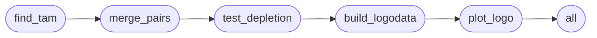

# tam_depletion_seq

```mermaid
graph LR
    0(["all"]);
    1(["plot_logo"]);
    2(["build_logodata"]);
    3(["test_depletion"]);
    4(["merge_pairs"]);
    5(["find_tam"]);
    1 --> 0
    2 --> 1
    3 --> 2
    4 --> 3
    5 --> 4
```

Identify depleted TAM from seqeuencing data and build the sequence logo.

